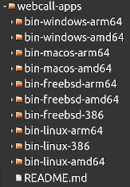

# WebCall Apps

Two WebRTC telephony apps:

- webcall (to make calls)

- callee (to receive and make calls)

for the following OS / architecture configurations:

- linux-amd64, linux-386, linux-arm64

- freebsd-amd64, freebsd-386, freebsd-arm64

- macos-amd64, macos-arm64

- windows-amd64, windows-arm64

# Installation

Download binary apps: [webcall-apps-v1.0.0-2023-03-27.zip](https://timur.mobi/webcall/_dl/webcall-apps-v1.0.0-2023-03-27.zip)

Select one of the OS / architecture folders and copy the two apps to a local directory where they can be easily executed.

Note: These apps can be lauched from the UI as well as from the terminal window.

Both apps make use of the Chrome / Chromium browser and need this browser to be installed on the machine.
However, the webcall and callee apps run independently of your Chrome / Chromium browser.
This means that you can exit and restart your browser without affecting the webcall apps.

# How to use

## webcall app

You can make calls by entering a command like this into a terminal window:

>webcall 30040044444

Alternatively you can also provide the complete WebCall link:

>webcall http5://timur.mobi/user/30040044444

The app will start in it's own window.
Click [Dial] (or hit tab return) to start dialing.

If you don't provide the required target ID (phone number) on the command line,
or if you start the webcall app from the UI, you will be asked to enter the target ID inside the app:

After you finish the call, you can close the webcall app.
Start it again to make another call.

## callee app

The callee app let's you receive web telephony calls. To do so, you will need a unique target ID.
If you don't have a target ID yet, go register one (or more) here: https://timur.mobi/callee/register

You can then start receiving calls like this:

>callee 12312312312

If you don't like to enter your WebCall ID every time you start the callee app,
or if you want to be able start the app from the UI,
you need to create the file .webcall.ini in your home folder and store a preset in it.

The .webcall.ini file may then look like this:

>arg=timur.mobi 12312312312

Once the callee app is connected ("Go online") to the WebCall server, you can let it
run in the background. If the callee app gets disconnected, it will try to reconnect automatically.
If a call comes in, the app will play a ringtone.

You can also use the callee app to make calls, for instance via the Contacts widget
or via a Missed call entry.

## More info:

https://github.com/mehrvarz/webcall

https://timur.mobi/webcall

# Building

You need Go (1.16+) installed. To build the two apps, you need to switch to both subdirectories (webcall and callee) separately.

Build for the current OS / architecture:

>./gobuild

Build for all supported OS / architectures:

>./gobuild-all

Note that the current release of webcall-apps make use of a forked https://github.com/mehrvarz/lorca.
To build webcall-apps, the two source code folders (webcall-app and the forked lorca) need to be located side by side.

# License

AGPL3.0 - see: [LICENSE](LICENSE)

## 3rd party code

- github.com/zserge/lorca
- github.com/hashicorp/logutils
- gopkg.in/ini

